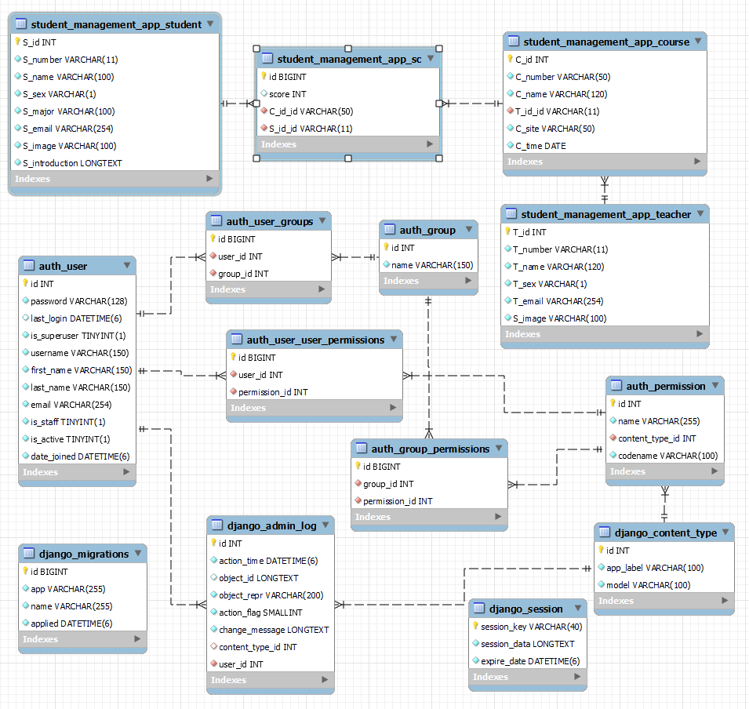
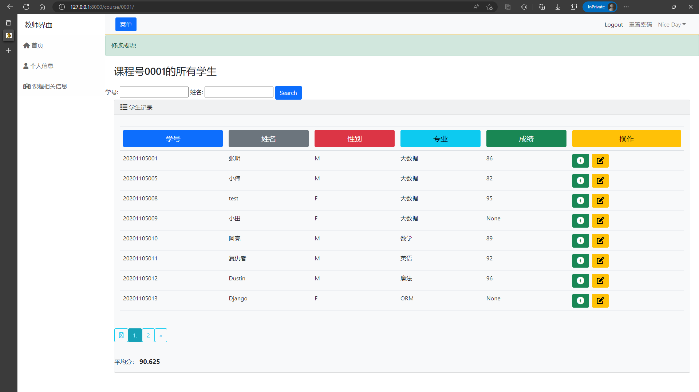
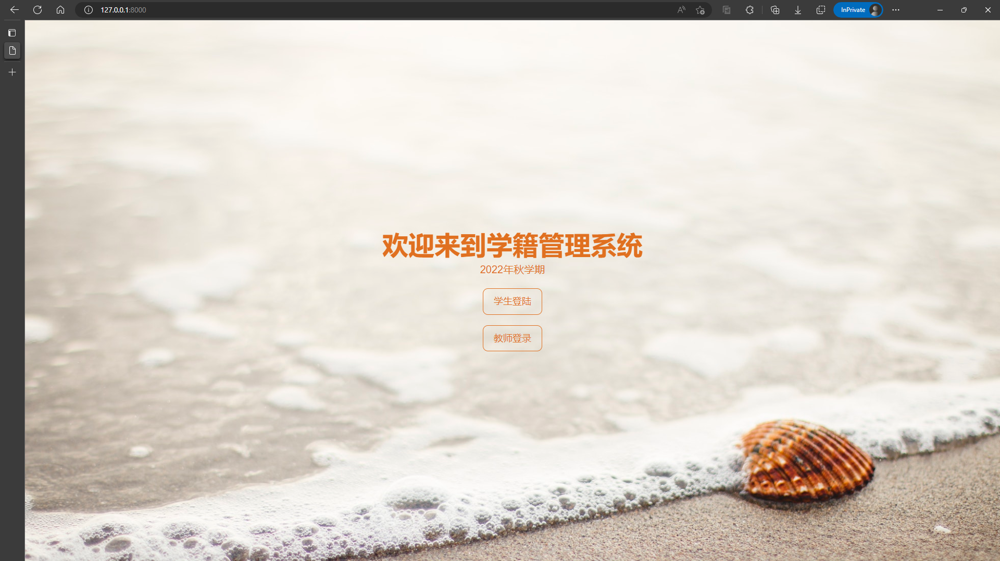
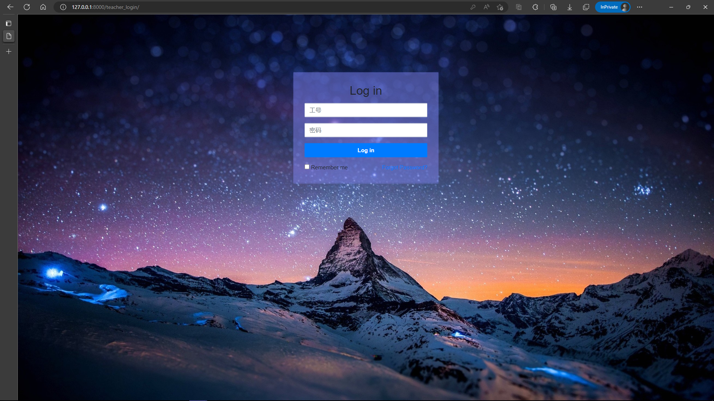
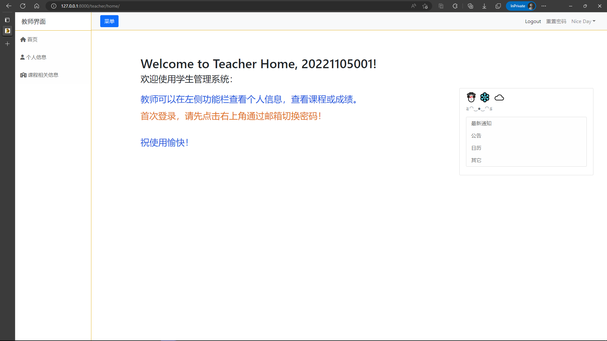
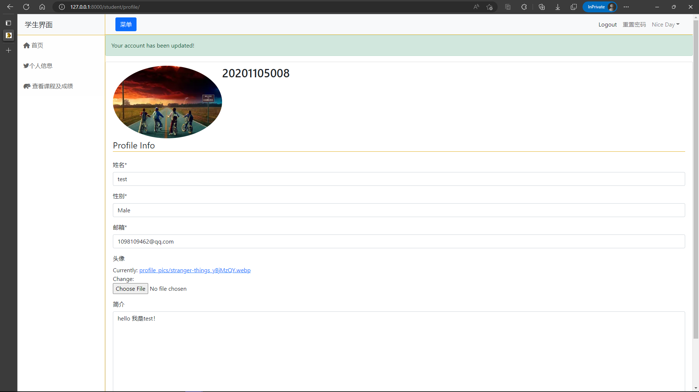
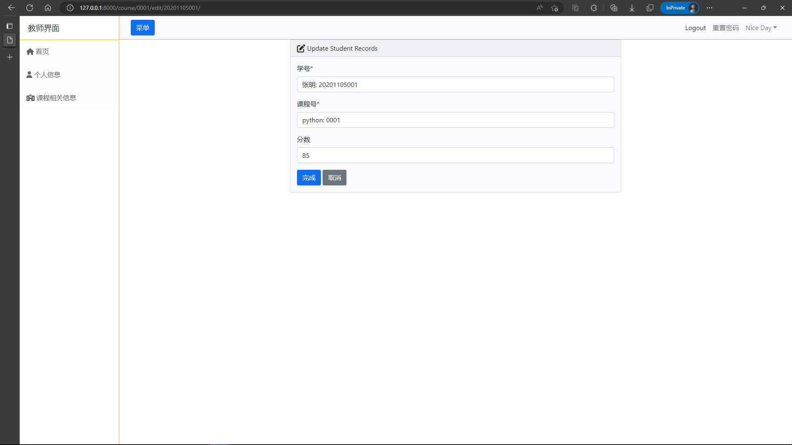
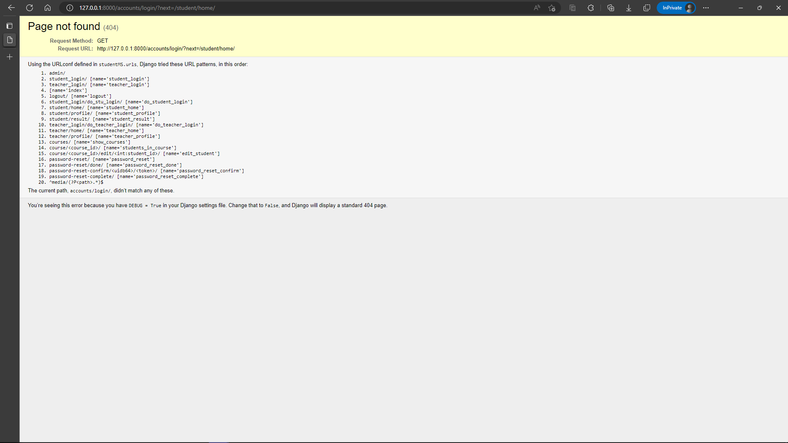
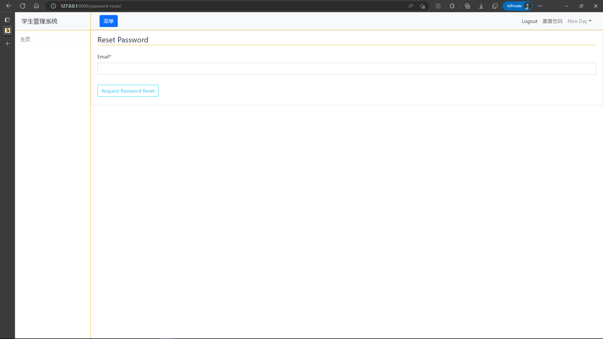

## 学生管理系统

### 登录账号

- 学生和老师：密码初始，通过**邮箱**修改
- 管理员：argon/***

### Built With
* Mysql
* Django
* Bootstrap

### Requirements
创建虚拟环境
* Python
* Django

美化表单form 和 查询过滤query
```sh
$ pip install crispy
```
```sh
$ pip install django-filter
```
浏览器
```sh
127.0.0.1:8000
```
### 使用
先在settings里更改DATABASES，默认注释是sqlite3，可以看到我采用的是本地的MySQL数据库。
连接数据库时，先执行
```
python manage.py makemigrations
python manage.py migrate
```
之后建议创建管理员，在127.0.0.1/admin页面进行数据的增删改查
```
python manage.py createsuperuser
```

另外邮箱验证修改密码，需要在settings.py最后设置自己的邮箱和相应smtp服务商给的密码。











### Contact 联系我：
邮箱： 1098109462@qq.com
